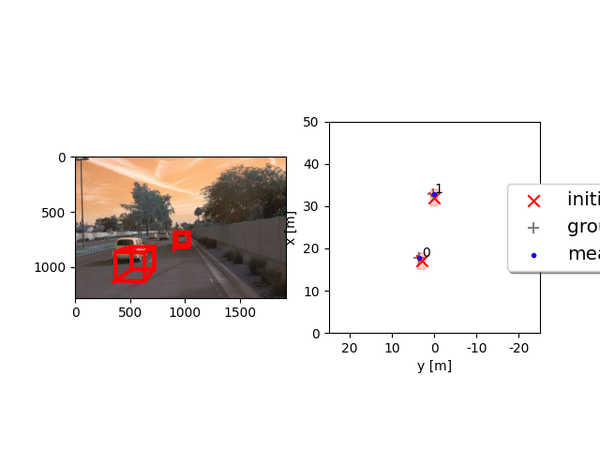
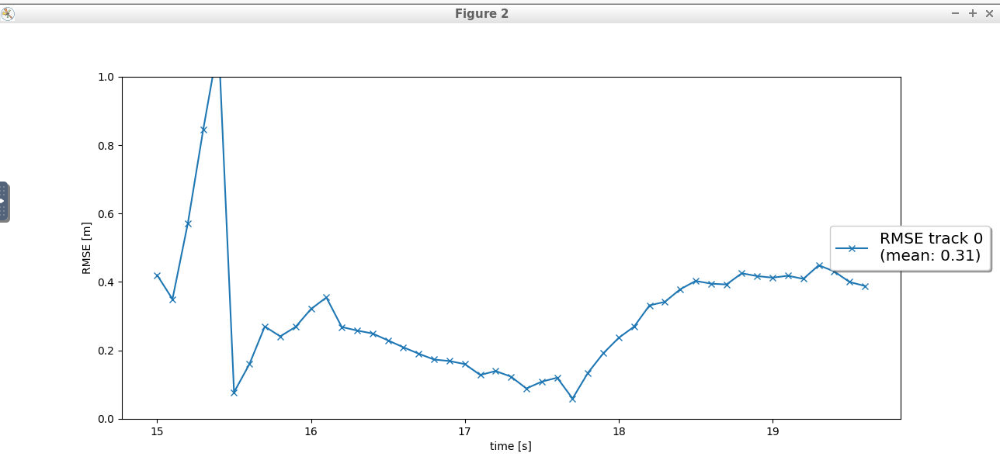
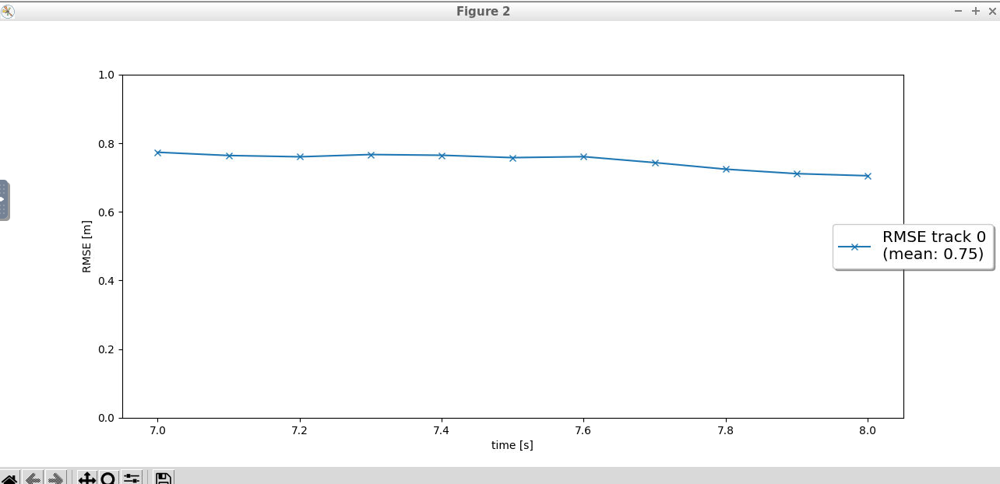
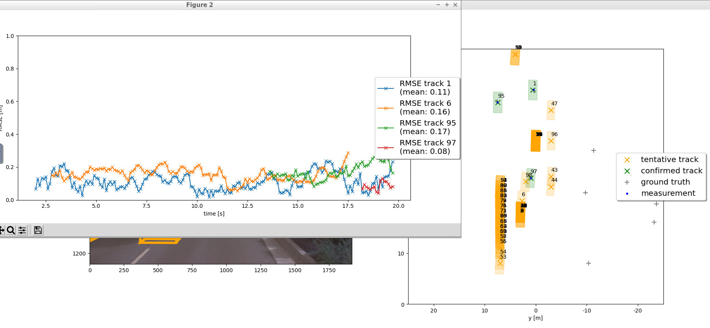
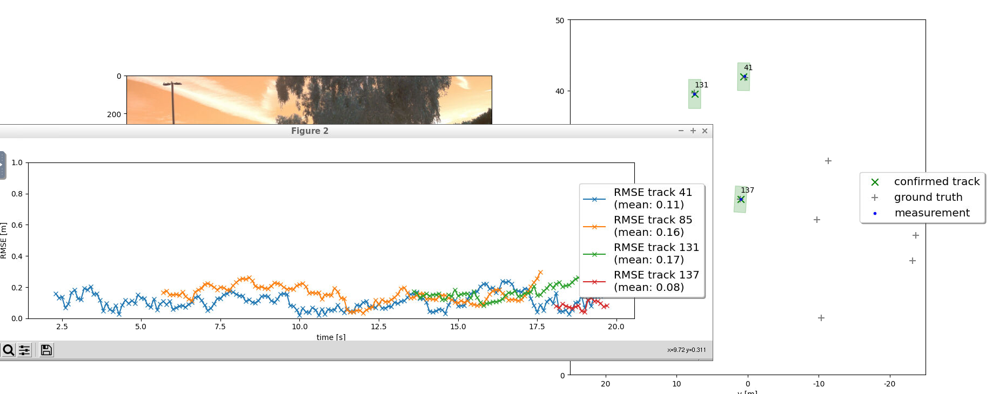

# Midterm writeup: Track 3D-Objects Over Time

## Short recap
### Step 1:
  The target was to extract the range image from the top-mounted LiDAR sensor, then extract the intensity and the range channels afterwards stack them in order to be viewed as a 2D image using OpenCV. The point-cloud frames of this range image is then converted into 3D image using Open3d.

  In sequence 3, starting from frame 13, the frames can be interpretted as a two-way road, in the opposite direction of the road, on the right-hand lane, a van and some sedans can be identified, on the left-hand side lane, a traffic jam queue can be identified which consists of hatch-backs and sedans. The direction of Waymo car contains a truck that pulls a trailer plus other cars.

  The car trailer has some persistent features such as:
  1. the truck towing rod.
  2. the trailer back barrier.
  3. the truck side mirrors.
  4. the tyres.

  The car queue have some persistent features such as:
  1. the empty spaces inside the cars.
  2. the license plates place shows no pcl, maybe the reflective material is diffusive.
  3. the side mirrors.
  4. the tyres.

### Step 2:
  Convert the point-cloud x-y coordinates into Birds-Eye View (BEV). The intensity channel shall be plotted as well using OpenCV in 2D image showing reflection intensity based on type of material. The height channel shall be plotted as well using OpenCV based on z-axis value of a point.

### Step 3:
  A pre-trianed Feature Pyramid Network Residual Neural Network (FPN ResNet) is used to detect vehicles in the given image frames.
  The NN configuration is as following:
    number of layers = 18
    number of classes = 3
    minimum IoU threshold = 0.6
    image size = 608 x 608

  The detected objects in BEV coordinate space must be converted into metric coordinates in vehicle space (3D bounding boxes).

### Step 4:
  Calculate precision and recall to understand system performance.

## Benefits in camera-lidar fusion compared to lidar-only tracking
Using camera-LiDAR helps eleminating ghost objects, detects traffic signs besides objects color.

## Challenges that a sensor fusion system face in real-life scenarios
Real-time processing is a challenge which I noticed during the project development.

# Final writeup: Track 3D-Objects Over Time

Lidar sensor fusion

Lidar and camera sensor fusion

## Short recap
### Filter:
Implemented Extended Kalman filter to predict and update tracked objects based on non-linear/linear measurements. RMSE shows high error in the start since the position is unknown in the begining, afterwards the RMSE goes lower as a result of track history.

### Track management:
Implemented algorithm to manage tracked objects states as well creation and deletion based on score and covariance of tracked object. RMSE is high since the association between track and measurement is still not implemented.

### Association:
Implemented association matrix that links the measurement to the related unassigned tracked object based on Mahalanobis distance, Simple Nearest Neighbor (SNN) and gating. RMSE is low but there are a lot of tentative tracks due to the FOV check is not yet implemented.

### Camera fusion:
Implemented FOV check in addition to initializing camera measurements. RMSE is low and only confirmed tracks are concluded at the end of the simulation.

## Benefits in camera-lidar fusion compared to lidar-only tracking (in theory and in your concrete results)
### In theory:
The RMSE and the amout of detected ghosts shall decrease. The track states shall be decided faster since the covariance would be smaller as a result of using 2 snesors.
### In practice:
Camera calibration affected the measurements that it could not support the LiDAR measurements, even it increased its covariance which lead to lower track score and eventually deleting the track.
No confirmed tracks were detected with the association of camera because of higher covariance, in contrast with the measurements with LiDAR only which gave results conforming to the ground truth.

To convert png images into video, use this command

`ffmpeg -framerate 5 -pattern_type glob -i '*.png' -c:v ffv1 lidar_tracking_results.avi`

## Challenges will a sensor fusion system face in real-life scenarios
Camera calibration is one of the challenges.

## Improving tracking results in the future
1. Use of more optimal distance calculation algorithm such as GNN or PDA.
2. Include z-axis in the calculations for better track estimation.
3. Fuse the data from multiple LiDAR sources.

## Interesting links for further study:
- If you want to deepen your knowledge in sensor fusion, you can take the Sensor Fusion nanodegree:\
  https://www.udacity.com/course/sensor-fusion-engineer-nanodegree--nd313

- Here is the PyTorch documentation, which is extensive, in case you want to learn more about PyTorch:\
  https://pytorch.org/docs/stable/index.html

- The Wikipedia article about Extended Kalman Filters is very informative, in case you want to deepen your knowledge of EKF:\
  https://en.wikipedia.org/wiki/Extended_Kalman_filter

- A reference link for understanding Sensor Fusion and Object Tracking:\
  https://www.mathworks.com/videos/series/understanding-sensor-fusion-and-tracking.html

- [Waymo dataset structure](Waymo_dataset_structure.txt)