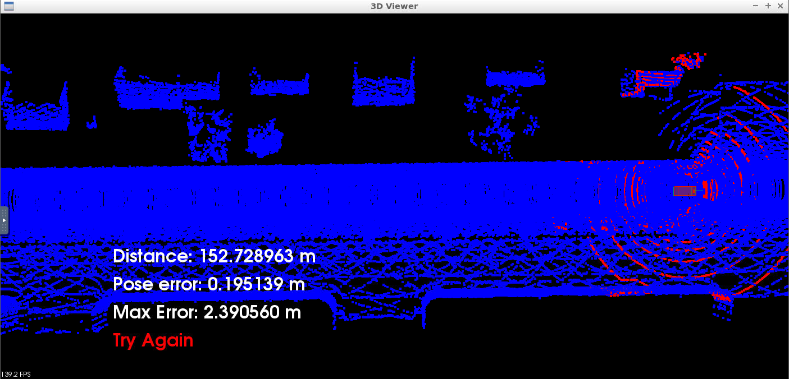

# Localization
## Background
GPS horizontal position fixes are typically accurate to about 15 meters. However, GPS fixes under a clear view of the sky are on average accurate to about 5 meters (16 ft) horizontally. Therefore there is a need to create an algorithm to increase the accuracy of position localization relative to the environment.
This can be simulated using CARLA simulator, The point cloud can be generated from simulated sensors that are fused into a sensor fusion system.

## Agorithms
1. Iterative closest point (ICP) _feature-wise_ \
The main advantage of ICP is that it can potentially make better use of small-scale features. It is also well-known, and is quite easy to to extend if sensor data with colour or other modalities is available.

2. normal distributions transform (NDT) _point-wise_ \
On the other hand, is much faster and can produce results that are as accurate or better than those of ICP. However, NDT introduces another parameter, namely the size of the individual cells, and is more sensitive to error in the initial pose estimate.

Reference: [Comparison of 3D Registration Algorithms for Autonomous Underground Mining Vehicles](https://www.researchgate.net/publication/229213972_A_Comparison_of_3D_Registration_Algorithms_for_Autonomous_Underground_Mining_Vehicles)

## Result
After trying both algorithms, NDT was chosen as the algorithm converges and gives better results, only 2.3m maximum error over a travelled distance of 153m.


## Compiling code
```
cd /home/workspace/c3-project
cmake .
make
```

## Running
```
su - student // Ignore Permission Denied, if you see student@ you are good
cd /home/workspace/c3-project
./run_carla.sh
// Create new tab
su - student // Ignore Permission Denied, if you see student@ you are good
cd /home/workspace/c3-project
./cloud_loc // Might have core dump on start up, just rerun if so. Crash doesn't happen more than a couple of times
```