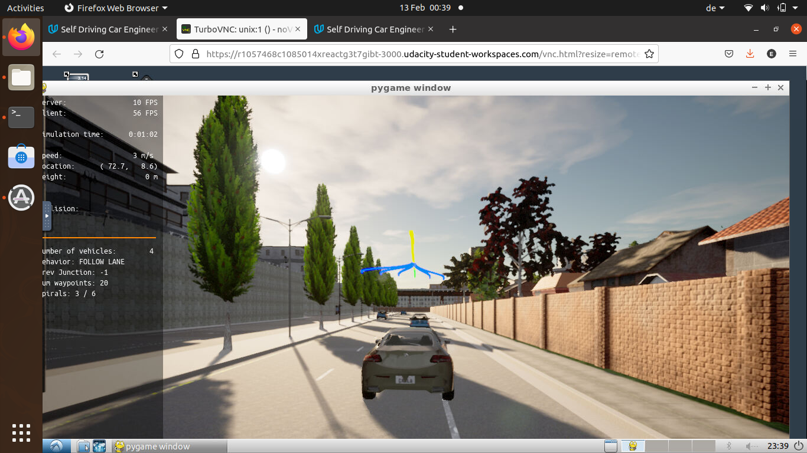
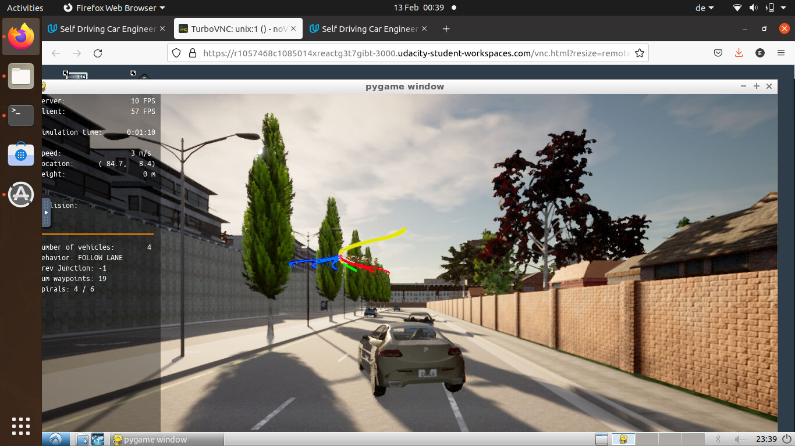
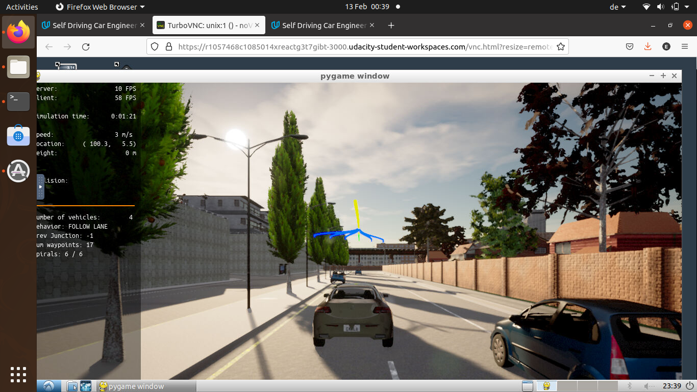
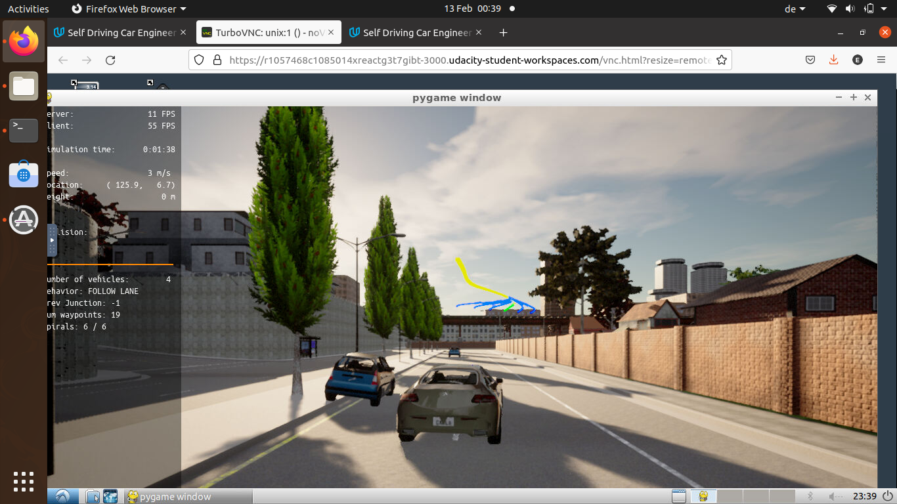
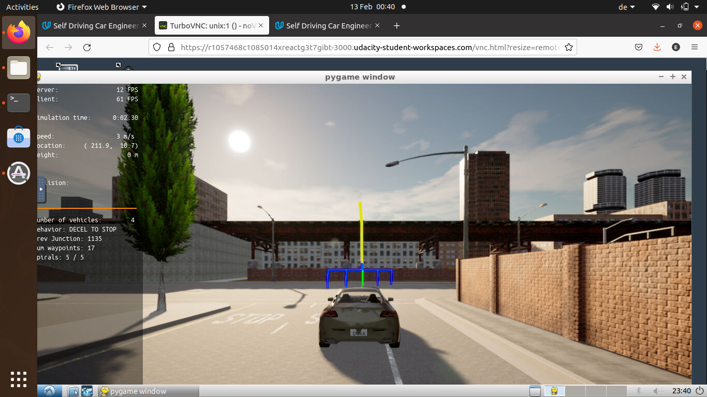

# Motion Planning and Decision Making for Autonomous Vehicles

In this project, you will implement two of the main components of a traditional hierarchical planner: The Behavior Planner and the Motion Planner.

## Objectives
Both will work in unison to be able to:
* Avoid static objects (cars, bicycles and trucks) parked on the side of the road (but still invading the lane). The vehicle must avoid crashing with these vehicles by executing either a “nudge” or a “lane change” maneuver.
* Handle any type of intersection (3-way,  4-way intersections and roundabouts) by STOPPING in all of them (by default)
* Track the centerline on the traveling lane.

## Used algorithms
* Behavioral planning logic using Finite State Machines - FSM
* Static objects Collision checking using the path search algorithm __hybrid A*__.
* Path and Trajectory generation using _Cubic Spirals_, this is done through using **Polynomial Trajectory Generation (PTG)**.
* Best trajectory selection though a cost function evaluation. This cost function will mainly perform a collision check and a proximity check to bring cost higher as we get closer or collide with objects but maintaining a bias to stay closer to the lane center line.

