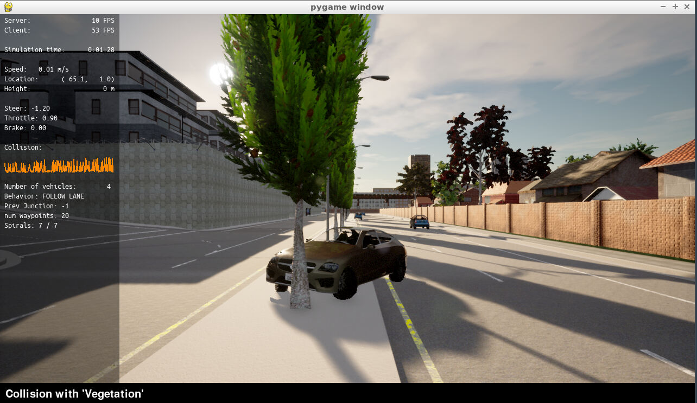
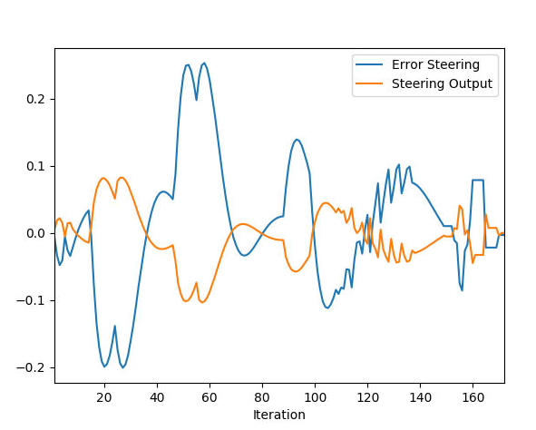
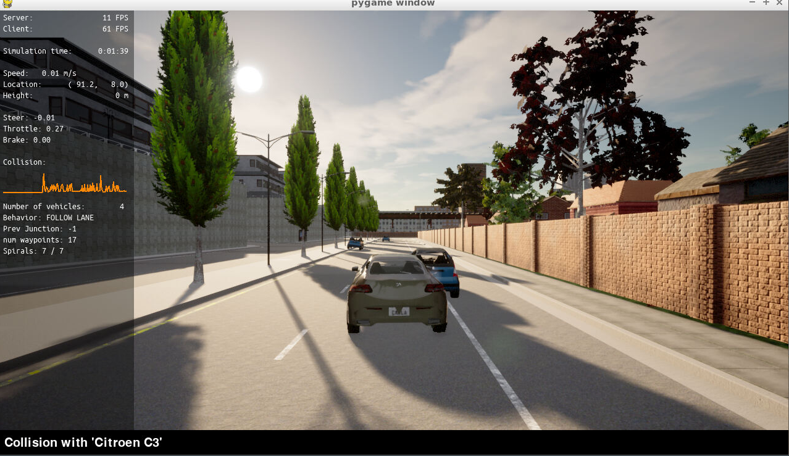

## Add the plots to your report and explain them (describe what you see)
### Static car
After setting up the environment, the car can be seen static in the scene.

## What is the effect of the PID according to the plots, how each part of the PID affects the control command?
After applying the PID controller to seering and throttle, there were several failed attempts that ended up by going out of the road and colliding with wall, tree or other cars.

PID hyperparameters tuning can be done manually as well as using the Twiddle algorithm, in this project both techniques were used but the final decision was in favor of manual tunning since it gives more flexibility and gives a sense how the hyperparameters affects the car control. The following table summerizes the effect of each parameter on the system.

| Parameter |   Rise Time  | Overshoot | Settling Time | Steadystate error |
|:---------:|:------------:|:---------:|:-------------:|:-----------------:|
| Kp        | Decrease     | Increase  | Small change  | Decrease          |
| Ki        | Decrease     | Increase  | Increase      | Decrease          |
| Kd        | Small change | Decrease  | Decrease      | No change         |

Proportional hyperparameter (P):
Increasing the proportional gain has the effect of proportionally increasing the control signal for the same level of error. Setting only P control is agressive and has oscillations.

Integral hyperparameter (I):
This parameter controls the accumulating error. Addition of this term reduces the steady state error. This parameter reduces the system bias error which accumulates over time

Derivative hyperparameter (D):
This parameter controls the rate of change of error. Addition of this term reduces the oscillary effect in the system. With derivative control, the control signal can become large if the error begins sloping upward, even while the magnitude of the error is still relatively small. This anticipation tends to add damping to the system, thereby decreasing overshoot.

The following approach is a best to tune manually:

Set all gains to zero.
* Increase the P gain until the response to a disturbance is steady oscillation.
* Increase the D gain until the the oscillations go away (i.e. it's critically damped).
* Repeat steps 2 and 3 until increasing the D gain does not stop the oscillations.
* Set P and D to the last stable values.

|    | Steering | Speed |
|:--:|:--------:|:-----:|
| Kp | 0.13     | 0.1   |
| Ki | 0.0001   | 0.002 |
| Kd | 1.0      | 0.0   |

The plots of output and error for steering is shown below, there is overshooting that can be solved according to the previously mentioned table.

The plots of output and error for throttle is shown below, there is Steadystate error and fast rise time that can be solved according to the previously mentioned table.

The vehicle controller managed to move the vehicle in a correct straight line with slight manouver to the left, unfortunately the vehicle collides laterally with the front vehicle but this can be resolved by tuning the hyperparameters.

## How would you design a way to automatically tune the PID parameters?
By using Twiddle algorithm, it assumes hyperparameters values for PID and based on current error measurements, it adds or subtracts small deltas from the proposed values. This process is done several times till the total sum of PID error values is falls below a predefined tolerance value.

## PID controller is a model free controller, i.e. it does not use a model of the car. Could you explain the pros and cons of this type of controller
This controller has several applications in different industries, in self-driving cars, pros would be decoupling of the car model errors from the controller, this increases the reliability of car control.
Cons would be that the controller doesn't take directly into consideration the environment factors like friction and air resistance but I believe that this is being reflected indirectly in the error measurements.

// (Optional) What would you do to improve the PID controller?