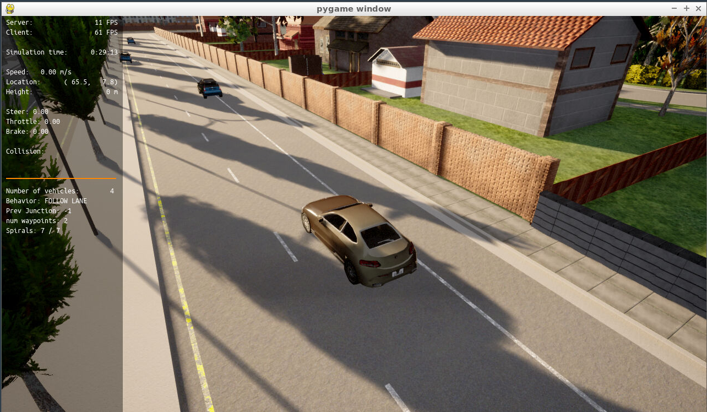
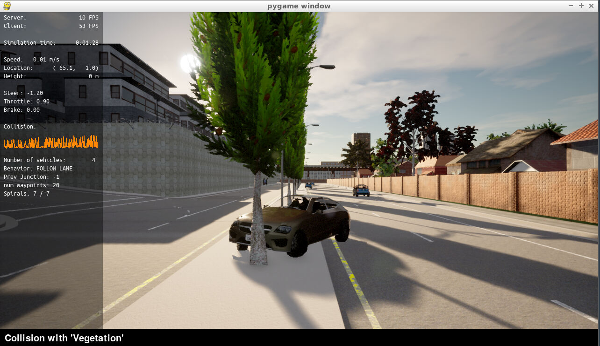
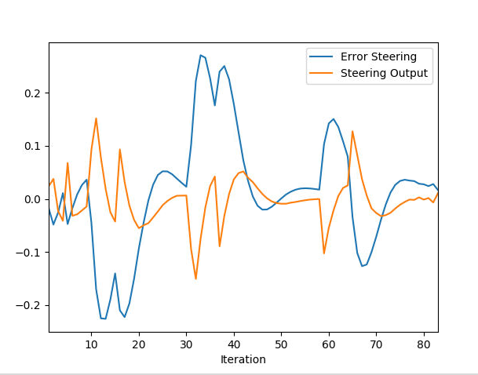
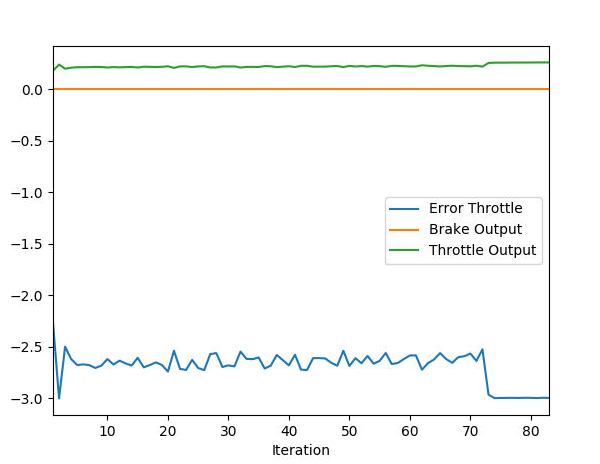
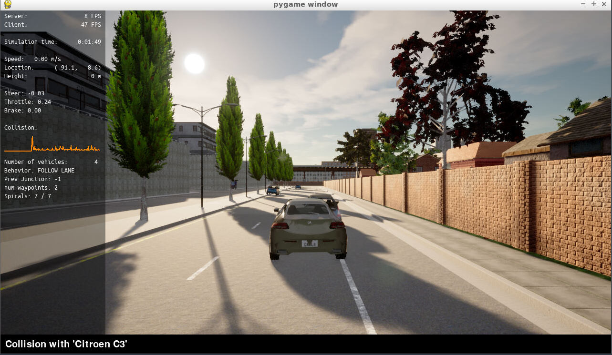
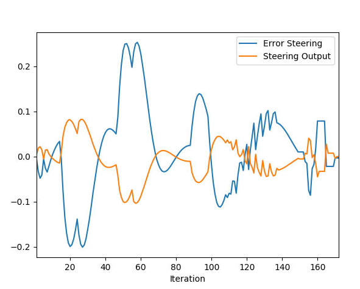
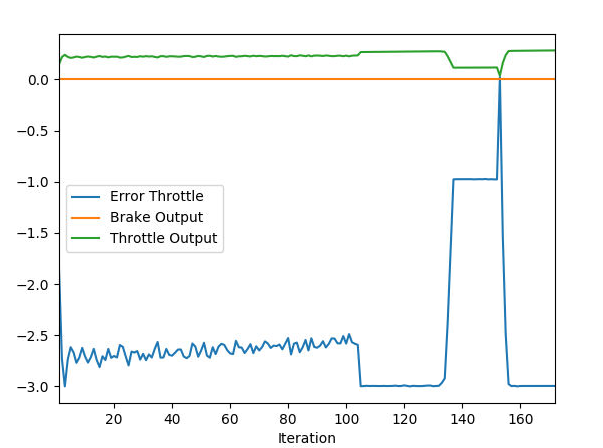
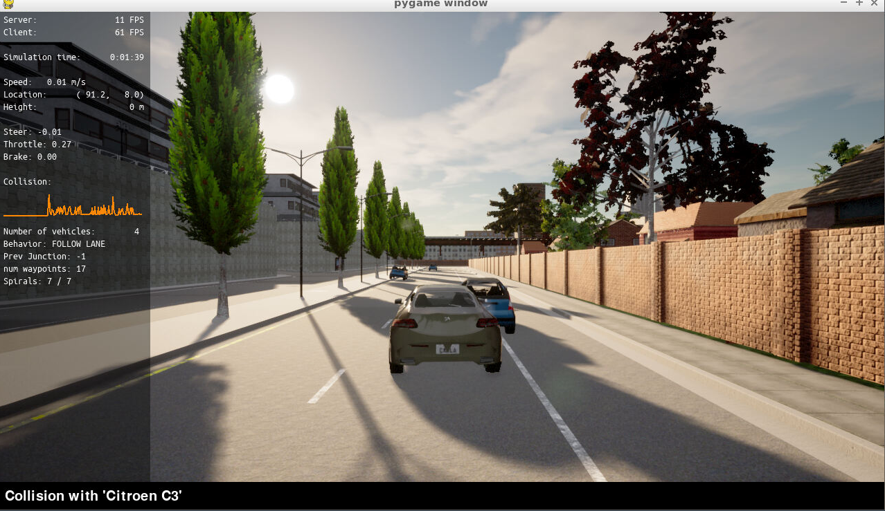

## Add the plots to your report and explain them (describe what you see)
### Static car
After setting up the environment, the car can be seen static in the scene.

## What is the effect of the PID according to the plots, how each part of the PID affects the control command?
After applying the PID controller to seering and throttle, there were several failed attempts that ended up by going out of the road and colliding with wall, tree or other cars.

PID hyperparameters tuning can be done manually as well as using the Twiddle algorithm, in this project both techniques were used but the final decision was in favor of manual tunning since it gives more flexibility and gives a sense how the hyperparameters affects the car control. The below table shows the hyperarameters values.

|    | Steering | Speed |
|:--:|:--------:|:-----:|
| Kp | 0.13     | 0.1   |
| Ki | 0.0001   | 0.002 |
| Kd | 1.0      | 0.0   |

More information and a script to show the effect of hyperparamaters tuning can be found [here](controller_script).

### Experiment 1
The plots of output and error for steering is shown below, there is overshooting that can be solved by increasing Kp and Ki and decreasing Kd. \

The plots of output and error for throttle is shown below, there is Steady-state error that can be solved by decreasing Kp and Ki. \

The vehicle controller managed to move the vehicle in a correct straight line with slight manouver to the left for about 1.5s, unfortunately the vehicle collides from front with the front vehicle. \

### Experiemnt 2
The plots of output and error for steering is shown below, there is overshooting that can be solved by increasing Kp and Ki and decreasing Kd according to the previously mentioned table in controller script. \

The plots of output and error for throttle is shown below, there is Steady-state error and fast rise time that can be solved by decreasing Kp and Ki\

The vehicle controller managed to move the vehicle in a correct straight line with slight manouver to the left, unfortunately the vehicle collides laterally with the front vehicle. There is a room for hyperparameter tuning and best way is to use an algorithm like Twiddle for that. \

## How would you design a way to automatically tune the PID parameters?
By using Twiddle algorithm, it assumes hyperparameters values for PID and based on current error measurements, it adds or subtracts small deltas from the proposed values. This process is done several times till the total sum of PID error values is falls below a predefined tolerance value.

## PID controller is a model free controller, i.e. it does not use a model of the car. Could you explain the pros and cons of this type of controller
This controller has several applications in different industries, in self-driving cars, pros would be decoupling of the car model errors from the controller, this increases the reliability of car control.
Cons would be that the controller doesn't take directly into consideration the environment factors like friction and air resistance but I believe that this is being reflected indirectly in the error measurements.