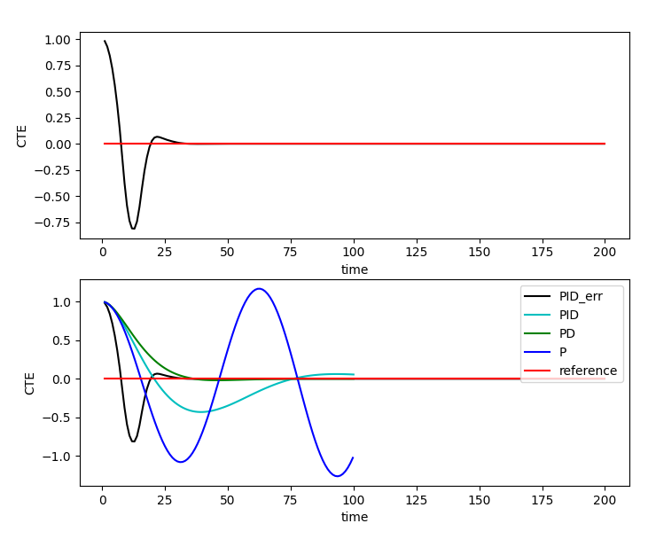

## PID controller
PID hyperparameters tuning can be done manually as well as using the Twiddle algorithm. The following table summerizes the effect of each parameter on the system.

| Parameter |   Rise Time  | Overshoot | Settling Time | Steadystate error |
|:---------:|:------------:|:---------:|:-------------:|:-----------------:|
| Kp        | Decrease     | Increase  | Small change  | Decrease          |
| Ki        | Decrease     | Increase  | Increase      | Decrease          |
| Kd        | Small change | Decrease  | Decrease      | No change         |

### Proportional hyperparameter (P):
Increasing the proportional gain has the effect of proportionally increasing the control signal for the same level of error. Setting only P control is agressive and has oscillations.

### Integral hyperparameter (I):
This parameter controls the accumulating error. Addition of this term reduces the steady state error. This parameter reduces the system bias error which accumulates over time

### Derivative hyperparameter (D):
This parameter controls the rate of change of error. Addition of this term reduces the oscillary effect in the system. With derivative control, the control signal can become large if the error begins sloping upward, even while the magnitude of the error is still relatively small. This anticipation tends to add damping to the system, thereby decreasing overshoot.

The formula for PID controller is
>`steer = (-tau_p * cte) - (tau_d * diff_cte) - (tau_i * int_cte)`

The generated graph for P, PD, PID or PID after twiddling using the error (cost) function is shown below

### The following approach is a best to tune manually:
* Set all gains to zero.
* Increase the P gain until the response to a disturbance is steady oscillation.
* Increase the D gain until the the oscillations go away (i.e. it's critically damped).
* Repeat steps 2 and 3 until increasing the D gain does not stop the oscillations.
* Set P and D to the last stable values.