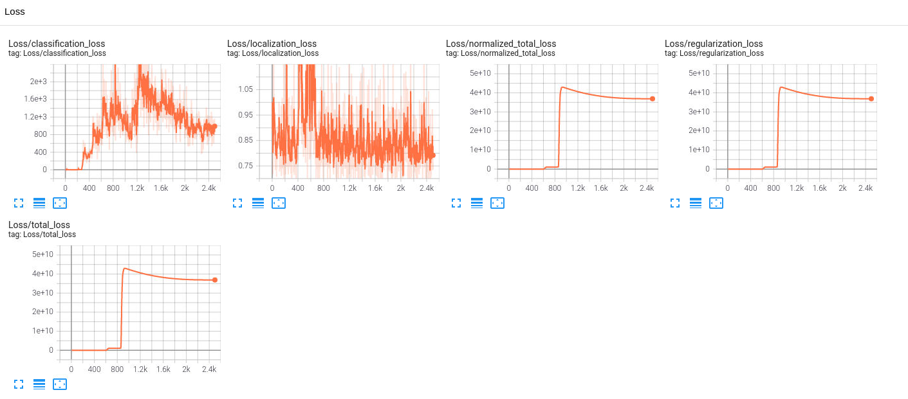
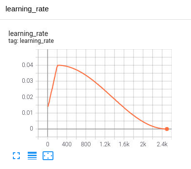
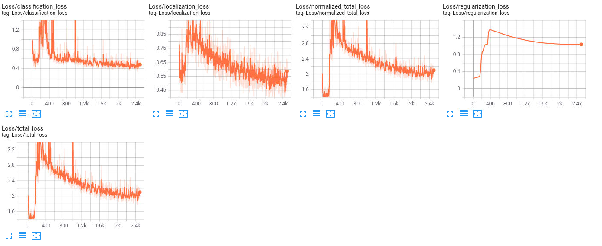
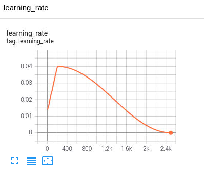

## Project overview
### Description:
Objective is to detect and classify vehicles, pedestrians and cyclist.
Using the open Waymo dataset, besides a pretrained model on Single-Shot Detection Residual Network, this model can transfer learning from the pretrained model since it has a small and similar dataset, the needed changes are to modify the model end layer and fine-tune it with the dataset.
This model is also using SSD ResNet and the advantage it provides is the ability to not over-fit the data by removing the gradient descent issues linked to activation functions in the deep layers by using skip connections.
The Waymo data tfrecords are large, hence a script will be used to download and extract the useful information into segments.

### Improvement
During the first training (babysit training), the observation of function loss will help determining the learning rate approperiate value from loss graphs.
Similar in the evaluation, the observation of accuracy will help determining if data is overfitting.

### Project steps are:
1. Data is already downloaded after being segmented, if not run
`python download_process.py --data_dirdata/waymo/training_and_validation`
2. Split the data into `data` folder by running
`python create_splits.py --data_dir /home/workspace/data/`
3. Install Chrome browser by running
`sudo apt-get install chromium-browser`
4. Analyse exploratory data in `analysis` folder by running
`./analysis/launch_jupyter.sh`
5. Configure the pipeline configuration file by running
`python edit_config.py --train_dir /home/workspace/data/train/ --eval_dir /home/workspace/data/val/ --batch_size 4 --checkpoint ./training/pretrained-models/ssd_resnet50_v1_fpn_640x640_coco17_tpu-8/checkpoint/ckpt-0 --label_map analysis/label_map.pbtxt`
6. Move the generated file `pipeline_new.config` into `training/reference/` and modify the segments paths inside it to the existing ones after the splitting.
7. Open tensorboard statistics by running the package
`python -m tensorboard.main --logdir training/reference/` then `tensorboard --logdir=train`
8. Remember to clean the content of `training/reference/` except for `pipeline_new.config` to save space.
9. Train the model by running
`python training/model_main_tf2.py --model_dir=training/reference/ --pipeline_config_path=training/reference/pipeline_new.config`
10. Evaluate the model by running
`python training/model_main_tf2.py --model_dir=training/reference/ --pipeline_config_path=training/reference/pipeline_new.config --checkpoint_dir=training/reference/`
11. Export result and create animation by running
`python exporter_main_v2.py --input_type image_tensor --pipeline_config_path training/reference/pipeline_new.config --trained_checkpoint_dir training/reference/ --output_directory training/exp2/exported_model/`
`python inference_video.py --labelmap_path label_map.pbtxt --model_path training/exp2/exported_model/saved_model --tf_record_path /home/workspace/data/test/\*\.tfrecord --config_path training/exp2/exported_model/pipeline.config --output_path training/exp2/animation.gif`
12. Improve the performance.

### Monitoring the GPU and killing processes
`sudo fuser -v /dev/nvidia0`
`sudo kill -9 <PID>`
`nvidia-smi`

### Importance of object detection in SDC:
Modern SDC use several sensors for object detection and classificaion, the latter one can be done only by cameras, their output is then fed to neural networks to achieve that.
This is crucial for sign recognition, differentiation between different objects here provides the ability to predict their behavior.

## Dataset
### Dataset analysis
This section should contain a quantitative and qualitative description of the dataset. It should include images, charts and other visualizations.
- There are 2 classes, cars, pedestrians.
- Trucks are classified as cars.
- Low camera resolution.
- Images are of low contrast (narrow pixel value distribution).
- There are no/few occlusion ojects.
- Most of the objects are far.
- Most of the car pictures are taken from front or rear side.
- No/few images with very bright/sunny light.

### Cross validation
This section should detail the cross validation strategy and justify your approach.
- Hold-out cross-validation is used.
- Since there are 100 data segments, training data is 75% used to train the model and validation data is 15% used to evaluate it.
- The testing dataset is 10% which is used once on the model to protect against data leakage between training and validation datasets.

### Training
#### Reference experiment #1
The learning rate is high, the accuracy is low for this dataset.

#### Reference experiment #2
Data augmentation is added to improve accuracy.

#### Reference experiment #3
Adam optimizer is introduced with constant learning rate.

## Improve on the reference
### SGD optimization algorithm
Momentum is a method that helps accelerate SGD in the relevant direction and dampens oscillation.
Adaptive Moment Estimation (Adam) is a method that computes adaptive learning rates for each parameter. In addition to storing an exponentially decaying average of past squared gradients, it also keeps an exponentially decaying average of past gradients, similar to momentum. Whereas momentum can be seen as a ball running down a slope, Adam behaves like a heavy ball with friction, which thus prefers flat minima in the error surface.

https://github.com/tensorflow/models/blob/master/research/object_detection/protos/optimizer.proto
Therefore Adam is used in this model with constant learning rate.

#### Data augmentation
The following image transformation are applied to the dataset during training, the choosing criteria is to mimic the real-world scenarios, therefore image padding, rotation are not selected, also transformation related to resolution are not selected since it will have a big impact on training and this is not needed at an early stage of model development:
- random_adjust_brightness
- random_adjust_contrast
- random_adjust_hue
- random_adjust_saturation
- random_crop_image
- random_black_patches
- random_self_concat_image
- autoaugment_image
- adjust_gamma
- random_resize_method 
