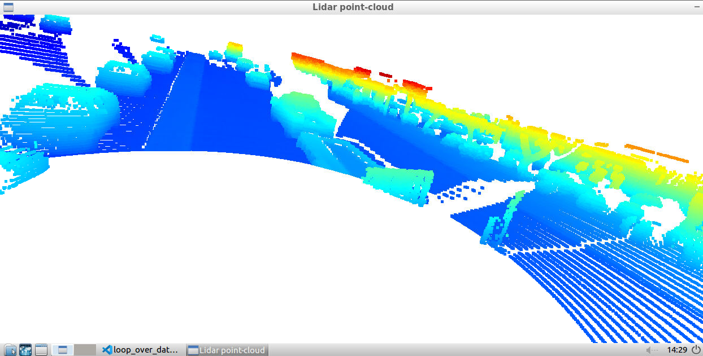
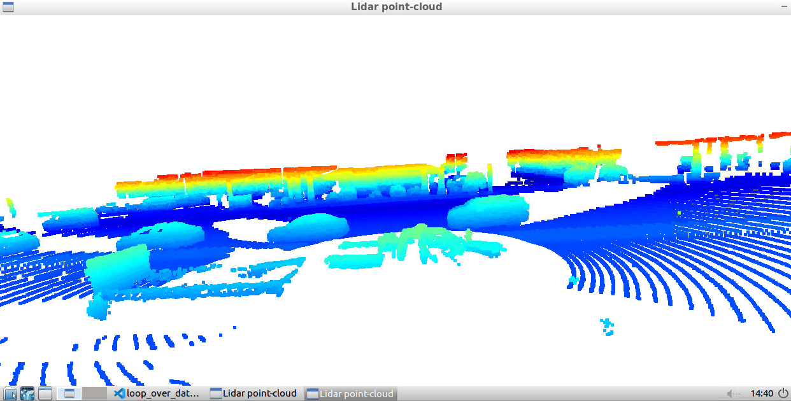
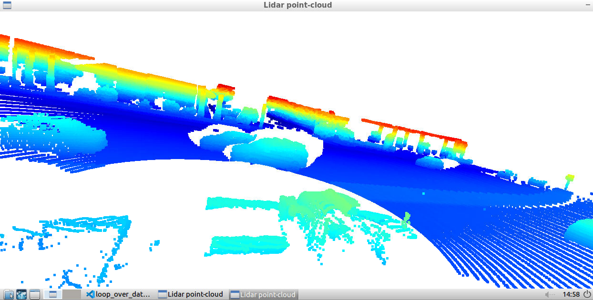
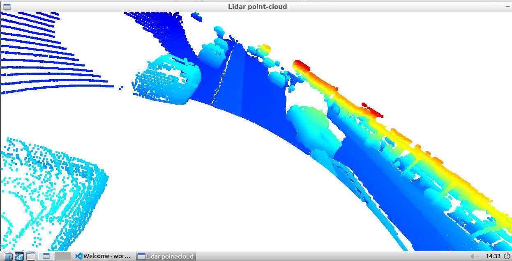
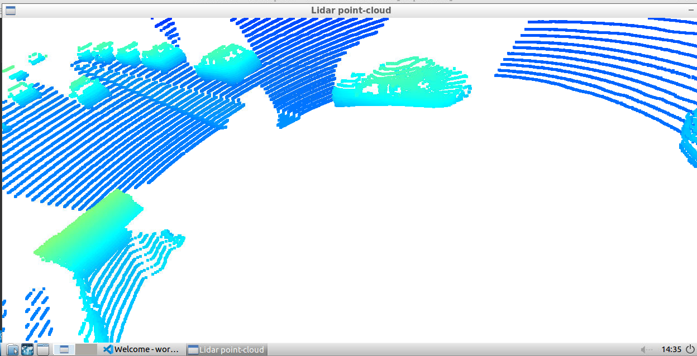
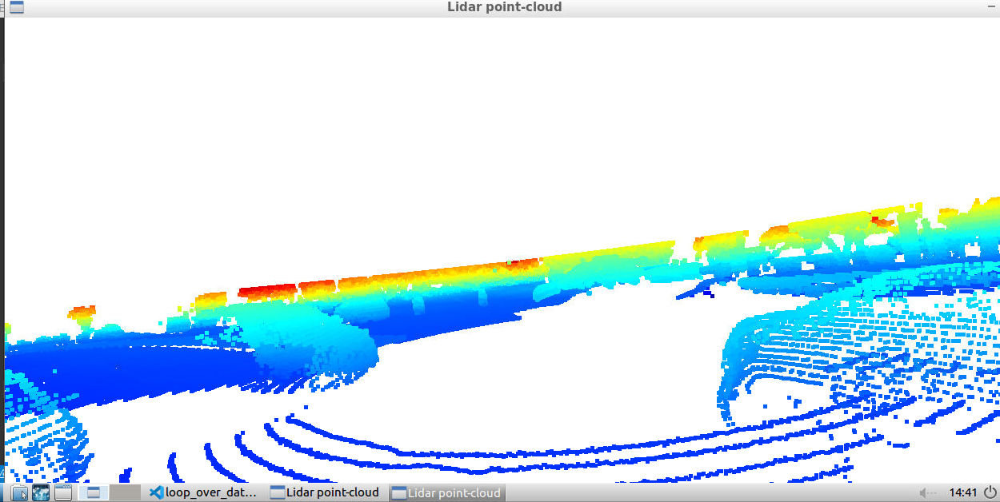
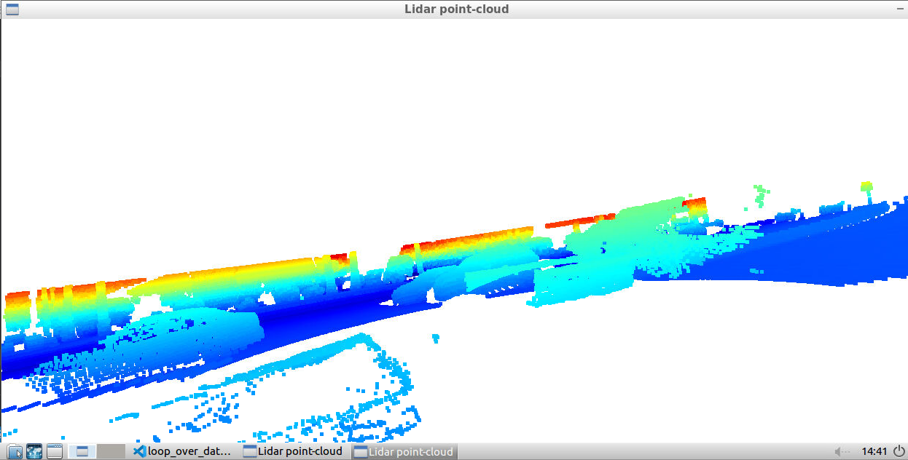

# Writeup: Track 3D-Objects Over Time

Please use this starter template to answer the following questions:

### 1. Write a short recap of the four tracking steps and what you implemented there (filter, track management, association, camera fusion). Which results did you achieve? Which part of the project was most difficult for you to complete, and why?
#### Step #1:
  The target was to extract the range image from the top-mounted LiDAR sensor, then extract the intensity and the range channels afterwards stack them in order to be viewed as a 2D image using OpenCV. The point-cloud frames of this range image is then converted into 3D image using Open3d.

  In sequence 3, starting from frame 13, the frames can be interpretted as a two-way road, in the opposite direction of the road, on the right-hand lane, a van and some sedans can be identified, on the left-hand side lane, a traffic jam queue can be identified which consists of hatch-backs and sedans. The direction of Waymo car contains a truck that pulls a trailer plus other cars.

  The car trailer has some persistent features such as:
  1. the truck towing rod.
  2. the trailer back barrier.
  3. the truck side mirrors.
  4. the tyres.

  The car queue have some persistent features such as:
  1. the empty spaces inside the cars.
  2. the license plates place shows no pcl, maybe the reflective material is diffusive.
  3. the side mirrors.
  4. the tyres.

####Step #2:
  Convert the point-cloud x-y coordinates into Birds-Eye View (BEV). The intensity channel shall be plotted as well using OpenCV in 2D image showing reflection intensity based on type of material. The height channel shall be plotted as well using OpenCV based on z-axis value of a point.

####Step #3:
  A pre-trianed Feature Pyramid Network Residual Neural Network (FPN ResNet) is used to detect vehicles in the given image frames.
  The NN configuration is as following:
    number of layers = 18
    number of classes = 3
    minimum IoU threshold = 0.6
    image size = 608 x 608

  The detected objects in BEV coordinate space must be converted into metric coordinates in vehicle space (3D bounding boxes).

####Step #4:
  Calculate precision and recall to understand system performance.

### 2. Do you see any benefits in camera-lidar fusion compared to lidar-only tracking (in theory and in your concrete results)?
Using camera-LiDAR helps eleminating ghost objects, detects traffic signs besides objects color.

### 3. Which challenges will a sensor fusion system face in real-life scenarios? Did you see any of these challenges in the project?
Real-time processing is a challenge I noticed during the project development.

### 4. Can you think of ways to improve your tracking results in the future?
