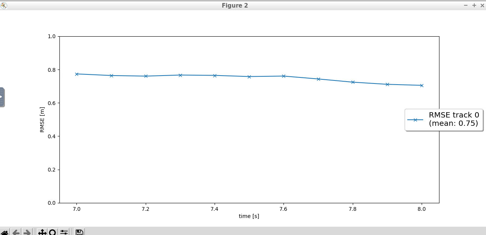

# Writeup: Track 3D-Objects Over Time

Please use this starter template to answer the following questions:

### 1. Write a short recap of the four tracking steps and what you implemented there (filter, track management, association, camera fusion). Which results did you achieve? Which part of the project was most difficult for you to complete, and why?
#### filter:
Implemented Extended Kalman filter to predict and update tracked objects based on non-linear/linear measurements. RMSE shows high error in the start since the position is unknown in the begining, afterwards the RMSE goes lower as a result of track history.

#### track management:
Implemented algorithm to manage tracked objects states as well creation and deletion based on score and covariance of tracked object. RMSE is high since the association between track and measurement is still not implemented.

#### association:
Implemented association matrix that links the measurement to the related unassigned tracked object based on Mahalanobis distance, Simple Nearest Neighbor (SNN) and gating. RMSE is low but there are a lot of tentative tracks due to the FOV check is not yet implemented.

#### camera fusion:
Implemented FOV check in addition to initializing camera measurements. RMSE is low and only confirmed tracks are concluded at the end of the simulation.

### 2. Do you see any benefits in camera-lidar fusion compared to lidar-only tracking (in theory and in your concrete results)?
#### in theory:
The RMSE and the amout of detected ghosts shall decrease. The track states shall be decided faster since the covariance would be smaller as a result of using 2 snesors.
#### in practice:
Camera calibration affected the measurements that it could not support the LiDAR measurements, even it increased its covariance which lead to lower track score and eventually deleting the track.
No confirmed tracks were detected with the association of camera because of higher covariance, in contrast with the measurements with LiDAR only which gave results conforming to the ground truth.

To convert png images into video, use this command
`ffmpeg -framerate 5 -pattern_type glob -i '*.png' -c:v ffv1 lidar_tracking_results.avi`

- 
- 

### 3. Which challenges will a sensor fusion system face in real-life scenarios? Did you see any of these challenges in the project?
Camera calibration is one of the challenges.

### 4. Can you think of ways to improve your tracking results in the future?
1. Use of more optimal distance calculation algorithm such as GNN or PDA.
2. Include z-axis in the calculations for better track estimation.
3. Fuse the data from multiple LiDAR sources.

### Interesting links for further study:
- If you want to deepen your knowledge in sensor fusion, you can take the Sensor Fusion nanodegree:
  https://www.udacity.com/course/sensor-fusion-engineer-nanodegree--nd313
- Here is the PyTorch documentation, which is extensive, in case you want to learn more about PyTorch:
  https://pytorch.org/docs/stable/index.html
- The Wikipedia article about Extended Kalman Filters is very informative, in case you want to deepen your knowledge of EKF:
  https://en.wikipedia.org/wiki/Extended_Kalman_
- A reference link for understanding Sensor Fusion and Object Tracking:
  https://www.mathworks.com/videos/series/understanding-sensor-fusion-and-tracking.html
